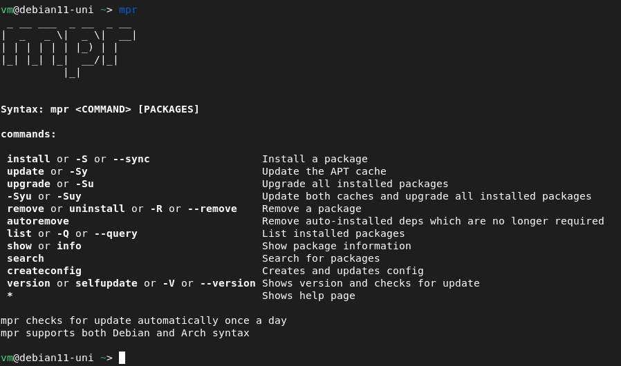

# mpr-install

A complete MPR helper

## Trello

[Trello](https://trello.com/b/0PaxQ7HH/mpr-install)

## Dependencies

* curl
* git
* jq
* make
* [makedeb](https://www.makedeb.org)
* [nala](https://gitlab.com/volian/nala) (optional)

## Install

1. Clone this repo:

```bash
git clone https://github.com/Adamekka/mpr-install
```

<!-- markdownlint-disable MD029 -->
2. Go to the **mpr-install** folder:

```bash
cd mpr-install/
```

3. Run **sudo make install** to install this script to your system:

```bash
sudo make install
```

4. (optional) Remove the **mpr-install** folder, that you cloned to your home folder:

```bash
cd .. && rm -rf mpr-install
```

## Usage



## Config

Config is created automatically using

```bash
mpr createconfig
```

You can find it in

```bash
~/.config/mpr/config.json
```

The only available options are **apt** and **nala**.
It is case sensitive.
If you set it to another value, then the script won't work properly.

## Uninstall

```bash
sudo rm /usr/bin/mpr
```

## Known issues

1. You do not have permission for the directory $BUILDDIR:


Fix: Delete the folder that it created previously.  
For example, downloading **btop** failed for me, so I had to **rm -rf btop/** and run **mpr install btop** again.

```bash
rm -rf PackageThatItFailedToDownload/
```

## Buy me a coffee :)))

[PayPal](https://paypal.me/retardant)
